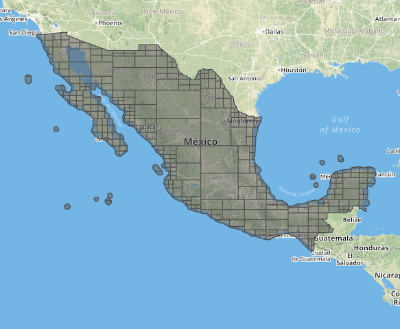

# Fallback Country Boundaries

Each place is assigned a `country_code` and partition. Partitions derive from `country_code`.

Nominatim imports two pre-generated files

   * `data/country_name.sql` (country code, name, default language, partition)
   * `data/country_osm_grid.sql` (country code, geometry)

before creating places in the database. This helps with fast lookups and missing data (e.g. if the data the user wants to import doesn't contain any country places).

The number of countries in the world can change (South Sudan created 2011, Germany reunification), so can their boundaries. This document explain how the pre-generated files can be updated.


## Country code

Each place is assigned a two letter country_code based on its location, e.g. `gb` for Great Britain. Or `NULL` if no suitable country is found (usually it's in open water then).

In `sql/functions.sql: get_country_code(geometry)` the place's center is checked against

   1. country places already imported from the user's data file. Places are imported by rank low-to-high. Lowest rank 2 is countries so most places should be matched. Still the data file might be incomplete.
   2. if unmatched: OSM grid boundaries
   3. if still unmatched: OSM grid boundaries, but allow a small distance


## Partitions

Each place is assigned partition, which is a number 0..250. 0 is fallback/other.

During place indexing (`sql/functions.sql: placex_insert()`) a place is assigned the partition based on its country code (`sql/functions.sql: get_partition(country_code)`). It checks in the `country_name` table.

Most countries have their own partition, some share a partition. Thus partition counts vary greatly.

Several database tables are split by partition to allow queries to run against less indices and improve caching.

   * `location_area_large_<partition>`
   * `search_name_<partition>`
   * `location_road_<partition>`


## Data files

### data/country_name.sql

Export from existing database table plus manual changes. `country_default_language_code` most taken from [https://wiki.openstreetmap.org/wiki/Nominatim/Country_Codes](), see `utils/country_languages.php`.


### data/country_osm_grid.sql

`country_grid.sql` merges territories by country. Then uses `function.sql: quad_split_geometry` to split each country into multiple [Quadtree](https://en.wikipedia.org/wiki/Quadtree) polygons for faster point-in-polygon lookups.

To visualize one country as geojson feature collection, e.g. for loading into [geojson.io](http://geojson.io/):

```
-- http://www.postgresonline.com/journal/archives/267-Creating-GeoJSON-Feature-Collections-with-JSON-and-PostGIS-functions.html

SELECT row_to_json(fc)
FROM (
  SELECT 'FeatureCollection' As type, array_to_json(array_agg(f)) As features
  FROM (
    SELECT 'Feature' As type,
    ST_AsGeoJSON(lg.geometry)::json As geometry,
    row_to_json((country_code, area)) As properties
    FROM country_osm_grid As lg where country_code='mx'
  ) As f
) As fc;
```

`cat /tmp/query.sql | psql -At nominatim > /tmp/mexico.quad.geojson`


