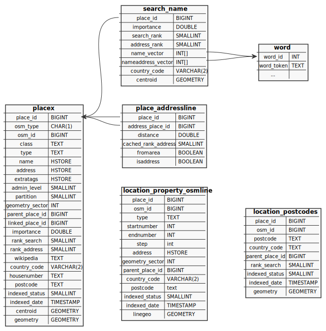
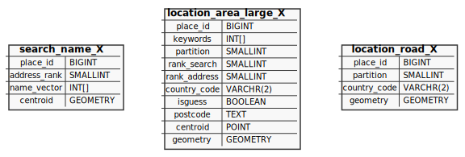

# Database Layout

### Import tables

OSM data is initially imported using [osm2pgsql](https://osm2pgsql.org).
Nominatim uses its own data output style 'gazetteer', which differs from the
output style created for map rendering.

The import process creates the following tables:

The `planet_osm_*` tables are the usual backing tables for OSM data. Note
that Nominatim uses them to look up special relations and to find nodes on
ways.

The gazetteer style produces a single table `place` as output with the following
columns:

 * `osm_type` - kind of OSM object (**N** - node, **W** - way, **R** - relation)
 * `osm_id` - original OSM ID
 * `class` - key of principal tag defining the object type
 * `type` - value of principal tag defining the object type
 * `name` - collection of tags that contain a name or reference
 * `admin_level` - numerical value of the tagged administrative level
 * `address` - collection of tags defining the address of an object
 * `extratags` - collection of additional interesting tags that are not
                 directly relevant for searching
 * `geometry` - geometry of the object (in WGS84)

A single OSM object may appear multiple times in this table when it is tagged
with multiple tags that may constitute a principal tag. Take for example a
motorway bridge. In OSM, this would be a way which is tagged with
`highway=motorway` and `bridge=yes`. This way would appear in the `place` table
once with `class` of `highway` and once with a `class` of `bridge`. Thus the
*unique key* for `place` is (`osm_type`, `osm_id`, `class`).

How raw OSM tags are mapped to the columns in the place table is to a certain
degree configurable. See [Customizing Import Styles](../customize/Import-Styles.md)
for more information.

### Search tables

The following tables carry all information needed to do the search:

The **placex** table is the central table that saves all information about the
searchable places in Nominatim. The basic columns are the same as for the
place table and have the same meaning. The placex tables adds the following
additional columns:

 * `place_id` - the internal unique ID to identify the place
 * `partition` - the id to use with partitioned tables (see below)
 * `geometry_sector` - a location hash used for geographically close ordering
 * `parent_place_id` - the next higher place in the address hierarchy, only
   relevant for POI-type places (with rank 30)
 * `linked_place_id` - place ID of the place this object has been merged with.
   When this ID is set, then the place is invisible for search.
 * `importance` - measure how well known the place is
 * `rank_search`, `rank_address` - search and address rank (see [Customizing ranking](../customize/Ranking.md)
 * `wikipedia` - the wikipedia page used for computing the importance of the place
 * `country_code` - the country the place is located in
 * `housenumber` - normalized housenumber, if the place has one
 * `postcode` - computed postcode for the place
 * `indexed_status` - processing status of the place (0 - ready, 1 - freshly inserted, 2 - needs updating, 100 - needs deletion)
 * `indexed_date` - timestamp when the place was processed last
 * `centroid` - a point feature for the place

The **location_property_osmline** table is a special table for
[address interpolations](https://wiki.openstreetmap.org/wiki/Addresses#Using_interpolation).
The columns have the same meaning and use as the columns with the same name in
the placex table. Only three columns are special:

 * `startnumber` and `endnumber` - beginning and end of the number range
    for the interpolation
 * `interpolationtype` - a string `odd`, `even` or `all` to indicate
    the interval between the numbers

Address interpolations are always ways in OSM, which is why there is no column
`osm_type`.

The **location_postcode** table holds computed centroids of all postcodes that
can be found in the OSM data. The meaning of the columns is again the same
as that of the placex table.

Every place needs an address, a set of surrounding places that describe the
location of the place. The set of address places is made up of OSM places
themselves. The **place_addressline** table cross-references for each place
all the places that make up its address. Two columns define the address
relation:

  * `place_id` - reference to the place being addressed
  * `address_place_id` - reference to the place serving as an address part

The most of the columns cache information from the placex entry of the address
part. The exceptions are:

  * `fromarea` - is true if the address part has an area geometry and can
    therefore be considered preceise
  * `isaddress` - is true if the address part should show up in the address
    output. Sometimes there are multiple places competing for for same address
    type (e.g. multiple cities) and this field resolves the tie.

The **search_name** table contains the search index proper. It saves for each
place the terms with which the place can be found. The terms are split into
the name itself and all terms that make up the address. The table mirrors some
of the columns from placex for faster lookup.

Search terms are not saved as strings. Each term is assigned an integer and those
integers are saved in the name and address vectors of the search_name table. The
**word** table serves as the lookup table from string to such a word ID. The
exact content of the word table depends on the [tokenizer](Tokenizers.md) used.

## Address computation tables

Next to the main search tables, there is a set of secondary helper tables used
to compute the address relations between places. These tables are partitioned.
Each country is assigned a partition number in the country_name table (see
below) and the data is then split between a set of tables, one for each
partition. Note that Nominatim still manually manages partitioned tables.
Native support for partitions in PostgreSQL only became useable with version 13.
It will be a little while before Nominatim drops support for older versions.

The **search_name_X** table is used to look up streets that appear in the
`addr:street` tag.

The **location_area_large_X** tables are used to look up larger areas
(administrative boundaries and place nodes) either through their geographic
closeness or through `addr:*` entries.

The **location_road** table is used to find the closest street for a
dependent place.

All three table cache specific information from the placex table for their
selected subset of places:

 * `keywords` and `name_vector` contain lists of term ids (from the word table)
   that the full name of the place should match against
 * `isguess` is true for places that are not described by an area

All other columns reflect their counterpart in the placex table.

## Static data tables

Nominatim also creates a number of static tables at import:

 * `nominatim_properties` saves settings that must not be changed after
    import
 * `address_levels` save the rank information from the
   [ranking configuration](../customize/Ranking.md)
 * `country_name` contains a fallback of names for all countries, their
   default languages and saves the assignment of countries to partitions.
 * `country_osm_grid` provides a fallback for country geometries

## Auxilary data tables

Finally there are some table for auxillary data:

 * `location_property_tiger` - saves housenumber from the Tiger import. Its
   layout is similar to that of `location_propoerty_osmline`.
 * `place_class_*` tables are helper tables to facilitate lookup of POIs
   by their class and type. They exist because it is not possible to create
   combined indexes with geometries.

