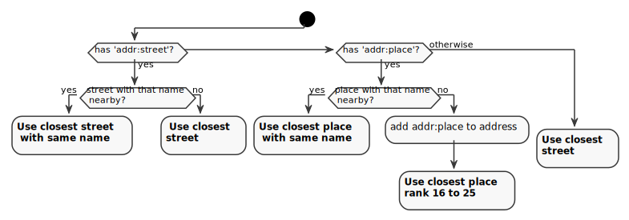

# Indexing Places

In Nominatim, the word __indexing__ refers to the process that takes the raw
OpenStreetMap data from the place table, enriches it with address information
and creates the search indexes. This section explains the basic data flow.

## Initial import

After osm2pgsql has loaded the raw OSM data into the place table,
the data is copied to the final search tables placex and location_property_osmline.
While they are copied, some basic properties are added:

 * country_code, geometry_sector and partition
 * initial search and address rank

In addition the column `indexed_status` is set to `1` marking the place as one
that needs to be indexed.

All this happens in the triggers `placex_insert` and `osmline_insert`.

## Indexing

The main work horse of the data import is the indexing step, where Nominatim
takes every place from the placex and location_property_osmline tables where
the indexed_status != 0 and computes the search terms and the address parts
of the place.

The indexing happens in three major steps:

1. **Data preparation** - The indexer gets the data for the place to be indexed
   from the database.

2. **Search name processing** - The prepared data is given to the
   tokenizer which computes the search terms from the names
   and potentially other information.

3. **Address processing** - The indexer then hands the prepared data and the
   tokenizer information back to the database via an `INSERT` statement which
   also sets the indexed_status to `0`. This triggers the update triggers
   `placex_update`/`osmline_update` which do the work of computing address
   parts and filling all the search tables.

When computing the address terms of a place, Nominatim relies on the processed
search names of all the address parts. That is why places are processed in rank
order, from smallest rank to largest. To ensure correct handling of linked
place nodes, administrative boundaries are processed before all other places.

Apart from these restrictions, each place can be indexed independently
from the others. This allows a large degree of parallelization during the indexing.
It also means that the indexing process can be interrupted at any time and
will simply pick up where it left of when restarted.

### Data preparation

The data preparation step computes and retrieves all data for a place that
might be needed for the next step of processing the search name. That includes

* location information (country code)
* place classification (class, type, ranks)
* names (including names of linked places)
* address information (`addr:*` tags)

Data preparation is implemented in pl/PgSQL mostly in the functions
`placex_indexing_prepare()` and `get_interpolation_address()`.

#### `addr:*` tag inheritance

Nominatim has limited support for inheriting address tags from a building
to POIs inside the building. This only works when the address tags are on the
building outline. Any rank 30 object inside such a building or on its outline
inherits all address tags when it does not have any address tags of its own.

The inheritance is computed in the data preparation step.

### Search name processing

The prepared place information is handed to the tokenizer next. This is a
Python module responsible for processing the names  from both name and address
terms and building up the word index from them. The process is explained in
more detail in the [Tokenizer chapter](Tokenizers.md).

### Address processing

Finally, the preprocessed place information and the results of the search name
processing are written back to the database. At this point the update trigger
of the placex/location_property_osmline tables take over and fill all the
dependent tables. This makes up the most work-intensive part of the indexing.

Nominatim distinguishes between dependent and independent places.
**Dependent places** are all places on rank 30: house numbers, POIs etc. These
places don't have a full address of their own. Instead they are attached to
a parent street or place and use the information of the parent for searching
and displaying information. Everything else are **independent places**: streets,
parks, water bodies, suburbs, cities, states etc.  They receive a full address
on their own.

The address processing for both types of places is very different.

#### Independent places

To compute the address of an independent place Nominatim searches for all
places that cover the place to compute the address for at least partially.
For places with an area, that area is used to check for coverage. For place
nodes an artificial square area is computed according to the rank of
the place. The lower the rank the lager the area. The `location_area_large_X`
tables are there to facilitate the lookup. All places that can function as
the address of another place are saved in those tables.

`addr:*` and `isin:*` tags are taken into account to compute the address, too.
Nominatim will give preference to places with the same name as in these tags
when looking for places in the vicinity. If there are no matching place names
at all, then the tags are at least added to the search index. That means that
the names will not be shown in the result as the 'address' of the place, but
searching by them still works.

Independent places are always added to the global search index `search_name`.

#### Dependent places

Dependent places skip the full address computation for performance reasons.
Instead they just find a parent place to attach themselves to.

By default a POI
or house number will be attached to the closest street. That can be any major
or minor street indexed by Nominatim. In the default configuration that means
that it can attach itself to a footway but only when it has a name.

When the dependent place has an `addr:street` tag, then Nominatim will first
try to find a street with the same name before falling back to the closest
street.

There are also addresses in OSM, where the housenumber does not belong
to a street at all. These have an `addr:place` tag. For these places, Nominatim
tries to find a place with the given name in the indexed places with an
address rank between 16 and 25. If none is found, then the dependent place
is attached to the closest place in that category and the addr:place name is
added as *unlisted* place, which indicates to Nominatim that it needs to add
it to the address output, no matter what. This special case is necessary to
cover addresses that don't really refer to an existing object.

When an address has both the `addr:street` and `addr:place` tag, then Nominatim
assumes that the `addr:place` tag in fact should be the city part of the address
and give the POI the usual street number address.

Dependent places are only added to the global search index `search_name` when
they have either a name themselves or when they have address tags that are not
covered by the places that make up their address. The latter ensures that
addresses are always searchable by those address tags.

